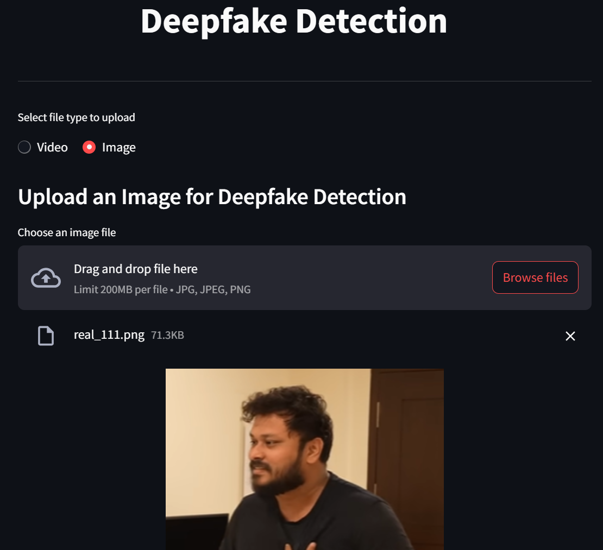

# 🛡️ DeepGuard AI — Deepfake Detection System

<p align="center">
  
</p>

<p align="center">
  <a href="#"></a>
  <a href="#"></a>
  <a href="#"></a>
  <a href="#"></a>
  <a href="#"></a>
  <a href="#"></a>
</p>

An enterprise-grade deepfake detection system powered by **EfficientNetB4** with MTCNN face localization, Grad-CAM interpretability, and V2 Cyclic Fine-Tuning.

---

## ✨ Key Features

| Feature | Description |
|:--------|:------------|
| 🧠 **EfficientNetB4 Backbone** | 19.3M parameter model fine-tuned on 100K+ real and fake face images |
| 🔄 **V2 Cyclic Fine-Tuning** | 6 non-overlapping data cycles to prevent overfitting and noise memorization |
| 🧹 **MD5 Hash Deduplication** | Automated dataset cleaning removing exact duplicate face samples |
| 👤 **MTCNN Face Detection** | Multi-Task Cascaded CNN face localization and bounding box overlays |
| 🔥 **Grad-CAM Focus Maps** | Visual explanation showing EXACT image regions the model focused on |
| 📹 **Image & Video Support** | Multi-frame temporal video diagnostics + single-image detection |
| 🎨 **Glassmorphism Dark UI** | Sleek Gradio web application with custom Cyberpunk dark styling |
| 🐳 **Docker Ready** | Containerized deployment with a single command |

---

## 📊 Benchmark Metrics (V2 Model)

| Metric | Score |
|:-------|:------|
| **Validation Accuracy** | **95.48%** |
| **Validation AUC** | **0.9913** |
| **Precision** | **95.66%** |
| **Recall** | **94.40%** |
| **Loss** | **0.1219** |

---

## 🚀 Quick Start

### 1. Clone & Install
```bash
git clone https://github.com/GUNPARK-GOOKIM/DEEPFAKE_DETECTION_MODEL.git
cd DEEPFAKE_DETECTION_MODEL
pip install -r requirements.txt
```

### 2. Launch Local Web App
```bash
python app.py
```
Open **`http://localhost:7860`** in your browser.

---

## 🏋️‍♂️ Training Pipeline (Google Colab)

To train or fine-tune the model from scratch on Google Colab:
1. Open [`train/DeepGuard_Training_Pipeline.ipynb`](train/DeepGuard_Training_Pipeline.ipynb) in Google Colab.
2. Select **Runtime → Change runtime type → T4 GPU**.
3. Click **Runtime → Run all**.
4. The notebook automatically downloads datasets, deduplicates images via MD5 hashing, loads pre-trained checkpoints, and runs **6 Cycles × 3 Epochs** of Cyclic Fine-Tuning.
5. The best model (`deepfake_model_best.keras`) is automatically saved to your Google Drive (`MyDrive/DeepGuard_AI/`).

---

## 🐳 Docker Deployment

```bash
# Build Docker image
docker build -t deepguard-ai .

# Run container
docker run -p 7860:7860 deepguard-ai
```

---

## 🏗️ Architecture & Pipeline

```
Input Image/Video → MTCNN Face Detection → Bounding Box Localization
                                                ↓
                                          EfficientNetB4
                                      (380×380 px Resolution)
                                                ↓
                                          Global Avg Pooling
                                                ↓
                                 Dropout(0.5) → Dense(256, ReLU)
                                                ↓
                                 Dropout(0.3) → Dense(1, Sigmoid)
                                                ↓
                               Verdict (Real / Fake) + Grad-CAM Heatmap
```

---

## 📁 Project Structure

```
DEEPFAKE_DETECTION_MODEL/
├── app.py                             # Gradio web application & custom UI
├── requirements.txt                   # Python dependencies
├── Dockerfile                         # Container deployment setup
├── DEPLOYMENT.md                      # Production deployment guide
├── .gitignore
├── README.md                          # Project documentation
│
├── train/
│   ├── DeepGuard_Training_Pipeline.ipynb  # ⭐ V2 Cyclic Training notebook
│   └── config.py                          # Hyperparameter configuration
│
├── inference/
│   ├── __init__.py
│   ├── predictor.py                   # Prediction engine & Grad-CAM generator
│   └── face_detector.py               # MTCNN face detector
│
├── streamlit/
│   └── deepfake_model_best.keras     # Trained V2 model weights
│
├── test data/
│   ├── Fake/                          # Sample fake test media
│   └── Real/                          # Sample real test media
│
└── demo/                              # Screenshots & visual assets
```

---

## 📄 License

This project is for educational and research purposes.

---

## 🤝 Contributing

1. Fork the repository
2. Create your feature branch (`git checkout -b feature/improvement`)
3. Commit your changes (`git commit -m 'Add improvement'`)
4. Push to the branch (`git push origin feature/improvement`)
5. Open a Pull Request

